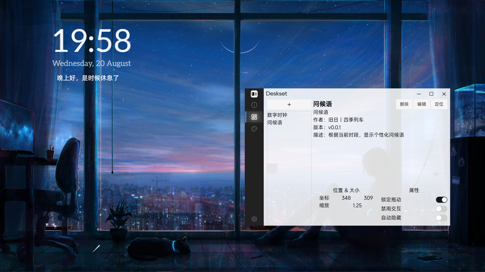

  </img>

  # 数字桌搭 Deskset

  
  
  

  
欢迎使用数字桌搭 Deskset

  
一款桌面美化软件

  
基于 Web 技术开发

  
让桌面成为专属于你的高效工作台

 

  <code>注意！数字桌搭正处于早期开发阶段，为了避免数据损失，建议定期备份重要文件</code>

## 简介
数字桌搭是一款采用 Tauri 框架开发的开源桌面美化应用，通过将网页嵌入系统桌面，用户能在该网页上定制自己的个性化桌面。软件内置时钟、秒表、倒计时、硬件监控、风格菜单等多个桌面美化部件。用户可以自由拖动，缩放，锁定这些部件，并将其位置，大小，属性保存进主题后分享给其他人。

### 效果展示

<!-- 用户手册 -->
## 使用教程
请按照以下步骤进行下载和配置
- 确保电脑拥有 [WebView2](https://developer.microsoft.com/microsoft-edge/webview2) 运行库
- 在 Obsidian 中安装 [DesksetNoteAPI](https://github.com/Nostalgia-Season-Train/DesksetNoteAPI) 和 [Dataview](https://github.com/blacksmithgu/obsidian-dataview) 插件
- 前往 [Releases](https://github.com/Nostalgia-Season-Train/Deskset/releases) 下载数字桌搭本体的压缩包，解压到独立目录
- 运行数字桌搭，进入设置页面后输入 DesksetNoteAPI 插件中的端口号、用户名和密码，即可绑定笔记仓库

## 亮点
Tauri + FastAPI 前后端分离架构，通过嵌入桌面背景的网页显示桌面部件
- 部件：数字桌搭拥有多种增加学习和工作效率的部件，这些部件都能自由拖动、锁定和动态隐藏（仅在鼠标滑入时显示）<!-- 术语规范：严格使用 "部件 Widget" 而非 "组件 Component"，明确区分 Vue SFC 组件与桌面美化部件 -->
  - 在桌面上组织管理笔记，统计仓库数据
  - 实时监控设备的运行状态，可视化硬件资源
  - 自定义菜单栏，减少查找应用所需时间
  - 时钟日历，显示现在的时间日期
- 主题：支持部件布局的创建与共享，可以保存/应用主题模板

<!-- 开发指南 -->
## 架构设计
数字桌搭主要由前端 Deskset 和后端 DesksetBack 两部分所组成：

Deskset：由 Tauri 编写的主程序，拥有两个窗口
- Desktop 桌面窗口：调用 setBottom.dll/SetParent 嵌入系统桌面的全屏窗口，显示桌面部件
- Manager 管理窗口：管理部件/主题的增删改查，配置 DesksetBack 工作流

DesksetBack：是 Deskset 的子程序，运行一个 FastAPI 服务器
- 前端桌面部件通过 axios 访问 DesksetBack REST API 获取数据
- （正在开发）工作流引擎，允许用户编写自己的自动化脚本

## 关联项目
[数字桌搭后端](https://github.com/Nostalgia-Season-Train/DesksetBack)：数字桌搭的数据中心和自动化引擎 
[数字桌搭笔记接口](https://github.com/Nostalgia-Season-Train/DesksetNoteAPI)：负责与后端通信的 Obsidian 插件

## 交流
QQ 群：770889923
