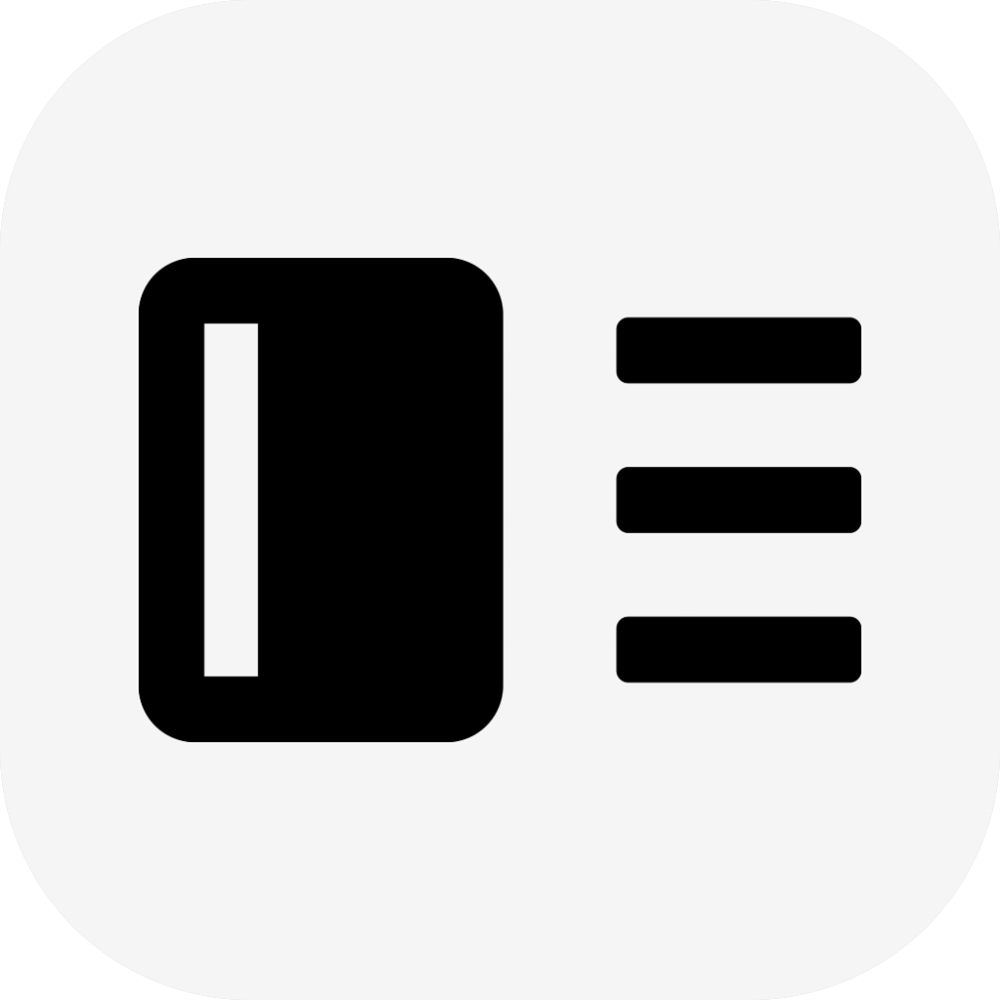

  </img>

  # 数字桌搭 Deskset

  
  
  

  
欢迎使用数字桌搭 Deskset

  
一款桌面美化软件

  
基于 Web 技术开发

  
实现桌面美化与笔记应用间的联动

 

  <code>注意！数字桌搭正处于早期开发阶段，为了避免数据损失，建议定期备份数字桌搭所绑定的笔记仓库</code>

## 简介
数字桌搭是一款专注整合笔记应用的桌面美化软件，旨在扩展笔记使用边界并集成自动化工作流，提升个人生产力。

## 下载&运行
前往 [Releases](https://github.com/Nostalgia-Season-Train/Deskset/releases) 下载压缩包，解压后即可使用。

## 亮点
Tauri + FastAPI 前后端分离架构，通过嵌入桌面背景的网页显示桌面部件
- 部件：数字桌搭拥有多种增加学习和工作效率的部件，这些部件都能自由拖动、锁定和动态隐藏（仅在鼠标滑入时显示）<!-- 术语规范：严格使用 "部件 Widget" 而非 "组件 Component"，明确区分 Vue SFC 组件与桌面美化部件 -->
  - 在桌面上组织管理你的笔记
  - 实时监控设备的运行状态，可视化硬件资源
  - 自定义菜单栏，最小化启动应用的操作步骤
  - 时钟日历，显示现在的时间日期
- 主题：支持部件布局的创建与共享，可以保存/应用主题模板

## 关联项目
[数字桌搭后端](https://github.com/Nostalgia-Season-Train/DesksetBack)：数字桌搭的数据中心和自动化引擎 
[数字桌搭笔记接口](https://github.com/Nostalgia-Season-Train/DesksetNoteAPI)：负责与后端通信的 Obsidian 插件

## 交流
QQ 群：770889923
